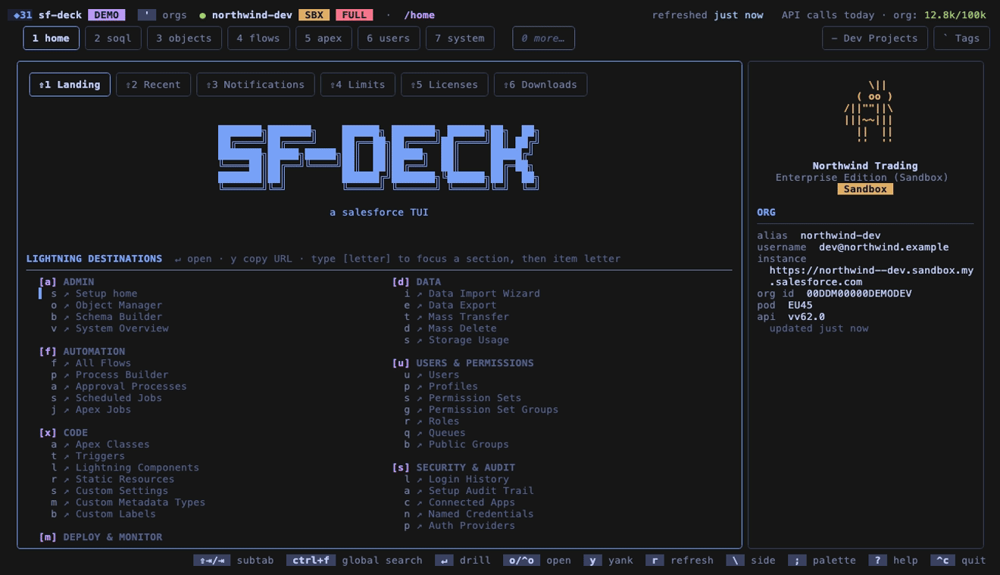

<!-- markdownlint-disable MD013 MD033 MD041 -->
<!-- GitHub README: centered hero/badges, details blocks, and wide tables are intentional. -->

<div align="center">

# sf-deck

**A keyboard-first Salesforce workspace for people working across multiple orgs.**

<p>
  <a href="https://github.com/Jacob-Stokes/sf-deck/actions/workflows/ci.yml"></a>
  <a href="https://github.com/Jacob-Stokes/sf-deck/releases"></a>
  <a href="LICENSE"></a>
</p>



<p>
  <a href="#install-and-try-it">Install</a> ·
  <a href="#keyboard-basics">Keyboard</a> ·
  <a href="#core-workflows">Capabilities</a> ·
  <a href="#safety-by-default">Safety</a> ·
  <a href="#automation-and-agents">Automation</a> ·
  <a href="https://sfdeck.dev/docs/">Docs</a>
</p>

</div>

sf-deck puts your Salesforce orgs in one terminal. Browse objects and records,
run SOQL, inspect permissions, and switch orgs without opening another tab.

It uses the orgs already authenticated with Salesforce CLI. No managed package,
connected app, Setup changes, or extra credentials. If `sf org list` works,
sf-deck is ready.

## Install and try it

You need the [Salesforce CLI](https://developer.salesforce.com/tools/salesforcecli)
with at least one authenticated org.

```sh
brew install --cask Jacob-Stokes/tap/sf-deck
sf-deck
```

Or explore three fictional orgs without making a network call:

```sh
sf-deck --demo
```

<details>
<summary><strong>Other installation options</strong></summary>

Download a macOS or Linux archive from the
[release page](https://github.com/Jacob-Stokes/sf-deck/releases),
or build from source with [Go 1.26.5+](https://go.dev/dl/):

```sh
git clone https://github.com/Jacob-Stokes/sf-deck
cd sf-deck
go build -o sf-deck ./cmd/sf-deck
```

</details>

## Keyboard basics

| Key | Action |
| --- | --- |
| `1`–`9` | Open a main workspace |
| `'` | Switch org |
| `/` | Filter the current list |
| `Enter` | Open the selected item |
| `Ctrl+F` | Search the active org |
| `[` / `]` | Cycle saved views or subtabs |
| `o` | Open the matching page in Lightning, Setup, or your editor |
| `?` | Show the keys available on the current screen |

The mouse also works. See the [complete keymap](https://sfdeck.dev/docs/reference/keymap/).

## Core workflows

- **Explore objects and metadata.** Browse schema, fields, record types,
  field-level security, Apex, Flows, components, packages, and settings.
- **Query and edit data.** Run SOQL with completion and history, work with
  records and reports, and export CSV, XLSX, or JSON.
- **Administer an org.** Inspect users, permissions, logins, deploys, tests,
  debug logs, jobs, and audit history.
- **Work across orgs.** Switch quickly, collect work with tags and dev
  projects, build sfdx bundles, and use the beta comparison tools.

Open a record in Lightning, a Flow in Flow Builder, or source in your editor
when you need a full canvas. See the [task walkthroughs](https://sfdeck.dev/docs/tasks/find-a-record/)
for complete workflows.

## Safety by default

Every org has a local safety level, always visible in the header:

| Level | Permitted through sf-deck |
| --- | --- |
| `read-only` | Browse, query, compare, and export |
| `records` | Read-only actions plus record create/update/delete |
| `metadata` | Record actions plus metadata writes, validation, and deploys |
| `full` | Destructive metadata operations and anonymous Apex |

Production orgs start read-only. Writes above the selected level are hidden in
the TUI and rejected by the CLI and IPC backend. Salesforce still enforces the
connected user's permissions; sf-deck adds another guardrail.

Read the full [safety model](https://sfdeck.dev/docs/concepts/safety/).

## Automation and agents

Run `sf-deck` for interactive work. Use headless commands in scripts and CI,
or the local IPC socket to drive a running TUI.

Core commands return a stable JSON envelope and scriptable exit codes:

```sh
sf-deck soql run       --org dev --query "SELECT Id, Name FROM Account LIMIT 5" --json
sf-deck record get     --org dev --id 001... --json
sf-deck org safety get --org prod --json
```

List the commands supported by each surface:

```sh
sf-deck verbs list --surface cli --json
sf-deck verbs list --surface ipc --json
```

The bundled [`skills/sf-deck`](skills/sf-deck) package gives AI agents the same
command discovery and safety model. See the [agent integration guide](https://sfdeck.dev/docs/agent-integration/).

## Authentication and local data

- Salesforce CLI owns authentication. Access tokens stay in memory and are not
  written to the cache or logs.
- Cached org data, settings, tags, saved queries, and dev projects live under
  `~/.sf-deck/`. Exports and bundles go where you choose.
- There is no telemetry, hosted backend, remote licence check, or sf-deck
  account.
- Update checks make at most one anonymous, version-free request to GitHub
  Releases every 24 hours. sf-deck never downloads or installs updates.
- IPC is local and user-only. Diagnostics are opt-in, authenticated, and
  loopback-only.

See the [on-disk layout](https://sfdeck.dev/docs/reference/on-disk-layout/)
and [security policy](.github/SECURITY.md). Disable update checks in
**Settings → Updates** or with `SF_DECK_NO_UPDATE_CHECK=1`.

## Platform support and maturity

sf-deck v0.1 is young, solo-maintained, and used daily against real orgs.

| Status | Areas |
| --- | --- |
| **Stable** | Home, objects/schema, records, users, permissions, SOQL, metadata browsing, packages, tags, system diagnostics |
| **Beta** | Reports, deploys and metadata writes, dev projects/bundles, cross-org compare, find-in-another-org |
| **Partial / planned** | System API-usage detail, dashboard viewing, native Windows support |

Release builds support macOS and Linux on arm64 and amd64. Windows users can
run the Linux build and Salesforce CLI together inside WSL2.

Current limitations:

- No bulk record mutation API; use the Salesforce CLI for bulk imports and
  updates.
- No async Apex test runner over IPC; long-running test workflows fall
  through to `sf`.
- Dashboard viewing is not implemented.

## FAQ

<details>
<summary><strong>How is this different from the Salesforce CLI or VS Code?</strong></summary>

The Salesforce CLI is command-oriented and VS Code is source-oriented.
sf-deck is org-oriented: browse live state, switch environments, compare them,
and assemble a working set. It complements both tools rather than replacing
them.

</details>

<details>
<summary><strong>Will this consume all of my org's API calls?</strong></summary>

sf-deck caches describes and list results, loads detail lazily, and does no
background polling. The header shows the active API count so the cost of an
action remains visible. You can clear or tune the local cache from Settings.

</details>

## Documentation

- [Install and first launch](https://sfdeck.dev/docs/getting-started/install/)
- [Keyboard basics](https://sfdeck.dev/docs/getting-started/keyboard-basics/)
- [Concepts: panels, chips, projects, bundles, tags, and safety](https://sfdeck.dev/docs/concepts/panels/)
- [Task walkthroughs](https://sfdeck.dev/docs/tasks/cross-org-workflow/)
- [CLI and IPC reference](https://sfdeck.dev/docs/reference/cli/)
- [Agent integration](https://sfdeck.dev/docs/agent-integration/)

## Contributing

Bug reports, focused fixes, and documentation improvements are welcome. Open
an issue before starting a large feature.

See [CONTRIBUTING.md](.github/CONTRIBUTING.md) for setup, tests, releases, and
architectural conventions.

## License

Apache-2.0 — see [LICENSE](LICENSE) and [NOTICE](NOTICE). Dependency license
texts included with release binaries live under
[`docs/third_party_licenses/`](docs/third_party_licenses/).

"Salesforce" is a registered trademark of Salesforce, Inc. This project is
not affiliated with, endorsed by, or sponsored by Salesforce, Inc.
