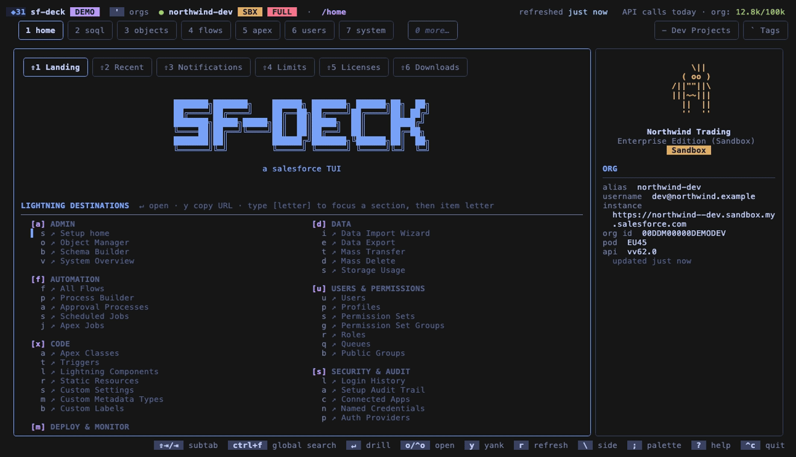
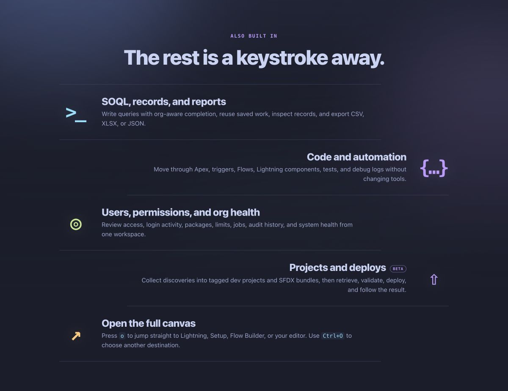
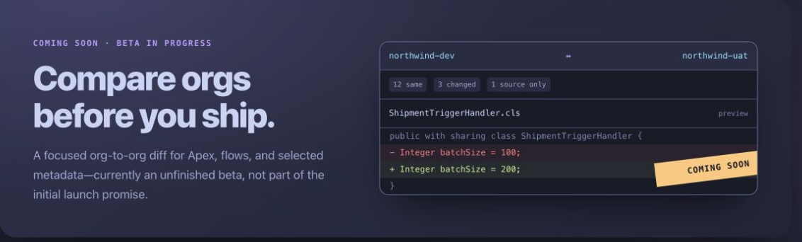

<!-- markdownlint-disable MD013 MD033 MD041 -->
<!-- GitHub README: centered hero/badges, details blocks, and wide tables are intentional. -->

<div align="center">

# sf-deck

**A keyboard-first Salesforce workspace for admins, developers, and architects working across multiple orgs.**

<p>
  <a href="https://github.com/Jacob-Stokes/sf-deck/actions/workflows/ci.yml"></a>
  <a href="https://github.com/Jacob-Stokes/sf-deck/releases"></a>
  <a href="LICENSE"></a>
</p>



<p>
  <a href="#install-and-try-it">Install</a> ·
  <a href="#keyboard-basics">Keyboard</a> ·
  <a href="#what-you-can-do">Capabilities</a> ·
  <a href="#automation-and-agents">Automation</a> ·
  <a href="https://sfdeck.dev/docs/">Docs</a>
</p>

</div>

sf-deck puts every Salesforce org you work with in one terminal and remembers
where you were in each one. Switch orgs, find what you need, and jump directly
into Lightning, Setup, Flow Builder, or your editor without rebuilding context.

It uses the orgs already authenticated with Salesforce CLI. No managed package,
connected app, Setup changes, or extra credentials. If `sf org list` works,
sf-deck is ready.

## Install and try it

You need the [Salesforce CLI](https://developer.salesforce.com/tools/salesforcecli)
with at least one authenticated org.

```sh
brew install --cask Jacob-Stokes/tap/sf-deck
sf-deck
```

Or explore three fictional orgs without making a network call:

```sh
sf-deck --demo
```

<details>
<summary><strong>Other installation options</strong></summary>

Linux users without Homebrew can download a package from the
[release page](https://github.com/Jacob-Stokes/sf-deck/releases).
Choose `amd64` for x86-64 systems or `arm64` for ARM systems.
In the commands below, replace `VERSION` and `ARCH` with the values in the
downloaded filename.

On Debian, Ubuntu, and derivatives:

```sh
sudo apt install ./sf-deck_VERSION_linux_ARCH.deb
```

On Fedora, RHEL, and derivatives:

```sh
sudo dnf install ./sf-deck_VERSION_linux_ARCH.rpm
```

These packages install `sf-deck` under `/usr/bin`. They do not configure an
APT or DNF repository, so upgrades require downloading the newer package.

Portable macOS and Linux archives are also available on the release page.
Extract an archive and install the binary somewhere on your `PATH`:

```sh
tar -xzf sf-deck_VERSION_linux_ARCH.tar.gz
sudo install -m 0755 sf-deck /usr/local/bin/sf-deck
```

To build from source, install [Go 1.26.6+](https://go.dev/dl/), then run:

```sh
git clone https://github.com/Jacob-Stokes/sf-deck
cd sf-deck
go build -o sf-deck ./cmd/sf-deck
```

</details>

## Keyboard basics

| Key | Action |
| --- | --- |
| `1`–`9` | Open a main workspace |
| `'` | Switch org |
| `/` | Filter the current list |
| `Enter` | Open the selected item |
| `Ctrl+F` | Search the active org |
| `[` / `]` | Cycle saved views or subtabs |
| `o` | Open the matching page in Lightning, Setup, or your editor |
| `?` | Show the keys available on the current screen |

The mouse also works. See the [complete keymap](https://sfdeck.dev/docs/reference/keymap/).

## What you can do

- **Move between orgs without losing your place.** Each org keeps its own
  workspace, filters, selection, and navigation state.
- **Find anything and open the right tool.** Search objects, fields, records,
  Flows, Apex, components, and other loaded metadata with `Ctrl+F`. Press `o`
  to open the selected item in Lightning, Setup, Flow Builder, or your editor.
- **Inspect schema, data, access, and automation together.** Browse records,
  permissions, field-level security, validation rules, users, and org health
  without crossing a maze of Setup pages.
- **Query and work with data.** Write SOQL with metadata completion, reuse saved
  queries and history, inspect or edit records, and export CSV, XLSX, or JSON.
- **Inspect code and ship changes.** Explore Flows, Apex, triggers, Lightning
  components, tests, debug logs, and deployments. Add related metadata to a dev
  project, generate an SFDX bundle, then retrieve, validate, or deploy it.

<p align="center">
  
</p>

See the [task walkthroughs](https://sfdeck.dev/docs/tasks/find-a-record/) for
complete workflows.

## Automation and agents

Run `sf-deck` for interactive work. Use headless commands in scripts and CI,
or the local IPC socket to drive a running TUI.

Core commands return a stable JSON envelope and scriptable exit codes:

```sh
sf-deck soql run       --org dev --query "SELECT Id, Name FROM Account LIMIT 5" --json
sf-deck record get     --org dev --id 001... --json
sf-deck org safety get --org prod --json
```

List the commands supported by each surface:

```sh
sf-deck verbs list --surface cli --json
sf-deck verbs list --surface ipc --json
```

The bundled [`skills/sf-deck`](skills/sf-deck) package gives AI agents the same
command discovery and safety model. See the [agent integration guide](https://sfdeck.dev/docs/agent-integration/).

<details>
<summary><strong>Install the Claude Code skill</strong></summary>

From a clone, install it for every project:

```sh
mkdir -p ~/.claude/skills
cp -R skills/sf-deck ~/.claude/skills/
```

Use `.claude/skills/` instead for one project. Run `/skills` to confirm the
installation; restart Claude Code if the new directory is not detected. Repeat
the copy after updating the repository.

</details>

## Platform support and maturity

sf-deck v0.1 is young, solo-maintained, and used daily against real orgs.

| Status | Areas |
| --- | --- |
| **Stable** | Home, objects/schema, records, users, permissions, SOQL, metadata browsing, packages, tags, system diagnostics |
| **Beta** | Reports, deploys and metadata writes, dev projects/bundles, find-in-another-org |
| **Coming soon** | Cross-org comparison for Apex, Flows, and selected metadata |
| **Partial / planned** | System API-usage detail, dashboard viewing, native Windows support |

Release builds support macOS and Linux on arm64 and amd64. Windows users can
run the Linux build and Salesforce CLI together inside WSL2.

<p align="center">
  
</p>

## Documentation

- [Install and first launch](https://sfdeck.dev/docs/getting-started/install/)
- [Keyboard basics](https://sfdeck.dev/docs/getting-started/keyboard-basics/)
- [Concepts: panels, chips, projects, bundles, tags, and safety](https://sfdeck.dev/docs/concepts/panels/)
- [Task walkthroughs](https://sfdeck.dev/docs/tasks/cross-org-workflow/)
- [CLI and IPC reference](https://sfdeck.dev/docs/reference/cli/)
- [Agent integration](https://sfdeck.dev/docs/agent-integration/)

## Privacy, security, and safety

sf-deck uses existing Salesforce CLI sessions. It has no telemetry or hosted
backend, and Salesforce data goes only to Salesforce. Working state stays
local, record and query results are not cached, and production orgs start
read-only. See the [privacy notice](PRIVACY.md),
[security policy](.github/SECURITY.md), and
[safety model](https://sfdeck.dev/docs/concepts/safety/) for details.

## Contributing

Bug reports, focused fixes, and documentation improvements are welcome. Open
an issue before starting a large feature.

See [CONTRIBUTING.md](.github/CONTRIBUTING.md) for setup, tests, releases, and
architectural conventions.

## Built with

The terminal interface is built with [Bubble Tea](https://github.com/charmbracelet/bubbletea),
[Bubbles](https://github.com/charmbracelet/bubbles), and
[Lip Gloss](https://github.com/charmbracelet/lipgloss).

## License

Apache-2.0 — see [LICENSE](LICENSE) and [NOTICE](NOTICE). Dependency license
texts included with release binaries live under
[`docs/third_party_licenses/`](docs/third_party_licenses/).

"Salesforce" is a registered trademark of Salesforce, Inc. This project is
not affiliated with, endorsed by, or sponsored by Salesforce, Inc.
